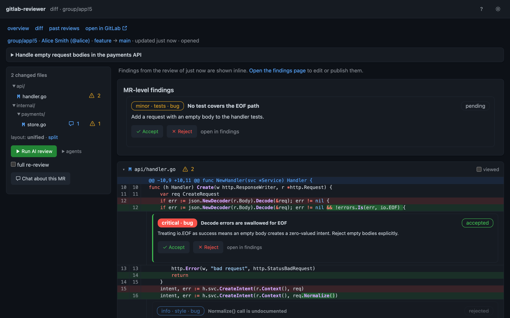
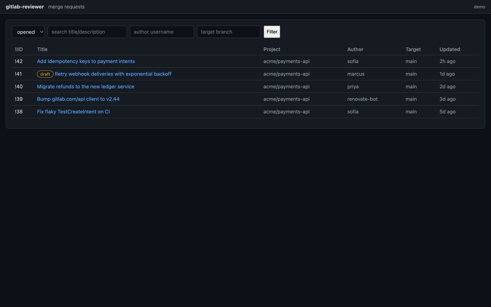
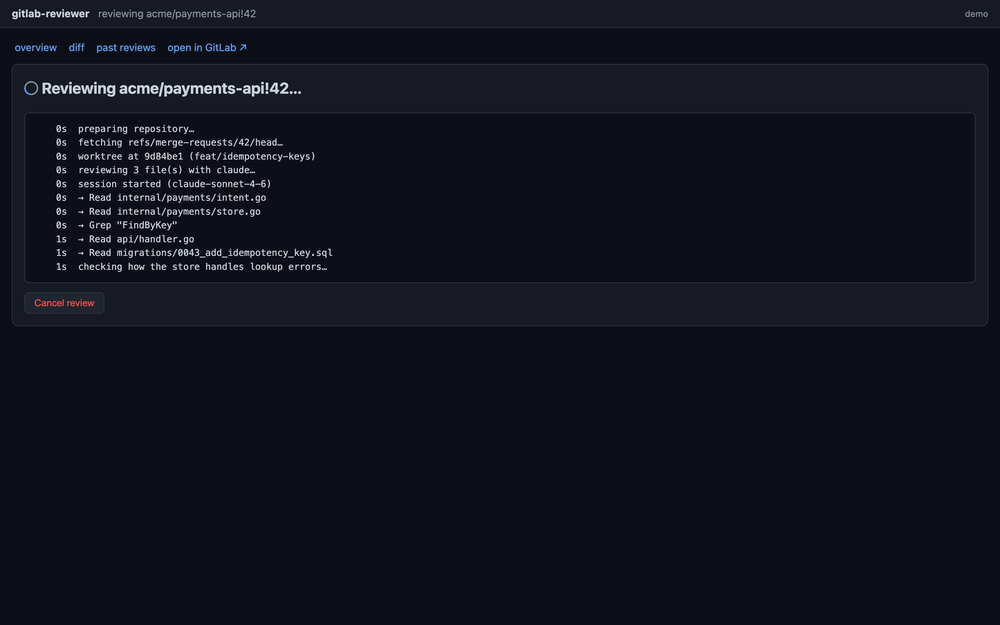
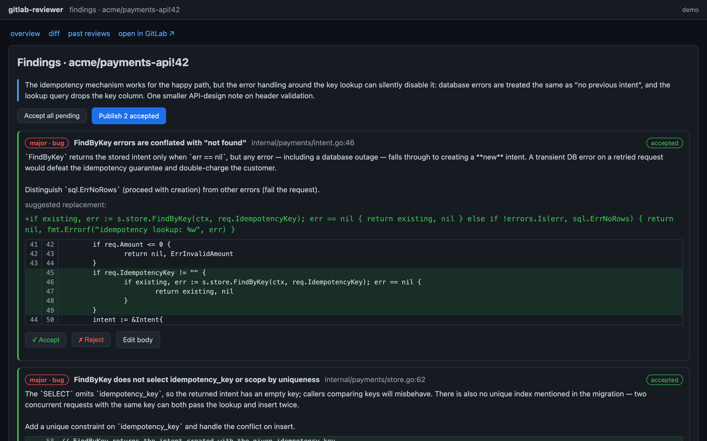

# gitlab-reviewer

A terminal UI that helps you review GitLab merge requests with Claude.

`gitlab-reviewer` lists open MRs across your configured GitLab projects and
groups, checks the MR branch out locally, and has the [Claude Code
CLI](https://docs.anthropic.com/en/docs/claude-code) review the change with
full repository context. Suggested review comments (bugs, security issues,
missing docs, style concerns) land in the TUI where you can edit, accept, or
reject each one before publishing them back to the MR as inline discussions
— immediately, or as a GitLab draft review published in one action.

Prefer a browser? The same workflow is available as a local web app via
[`gitlab-reviewer gui`](#browser-gui).

 <!-- TODO: record demo GIF -->

## How it works

1. **Browse** — the TUI lists open merge requests across the projects and
   groups you configure, with filtering by state, author, target branch, and
   free-text search. With no scope configured it first lists your available
   groups and projects so you can pick one inside the TUI.
2. **Review** — Claude runs locally against a checkout of the MR branch, so
   it can explore the whole repository (read files, grep for callers), not
   just the diff. Reviews always run in a detached git worktree at the MR
   head commit; your working tree is never touched. Large MRs are split into
   multiple review passes automatically, and individual diffs too large to
   inline are written into the checkout as files for Claude to read.
3. **Curate** — every suggested comment is shown against its diff hunk and
   is editable and individually acceptable or rejectable before anything
   leaves your machine.
4. **Publish** — accepted comments become positioned inline discussions on
   the MR (with a general-note fallback when a position cannot be resolved),
   either immediately or as a draft review published in one action.

## Requirements

- The [`claude` CLI](https://docs.anthropic.com/en/docs/claude-code) ≥ 2.0
  on your `PATH` (hard requirement — `gitlab-reviewer` shells out to it)
- `git`
- A GitLab personal or project access token with `api` scope (GitLab ≥ 16.x
  for draft reviews)
- An Anthropic API key / Claude subscription, or AWS Bedrock access

## Installation

### Prebuilt binaries

Download the archive for your platform (linux/darwin, amd64/arm64) from the
[releases page](https://github.com/RobertYoung/gitlab-reviewer-cli/releases),
verify it against `checksums.txt`, and put `gitlab-reviewer` on your `PATH`.

### go install

```sh
go install github.com/RobertYoung/gitlab-reviewer-cli/cmd/gitlab-reviewer@latest
```

## Quickstart

```sh
export GITLAB_REVIEWER_GITLAB_TOKEN=glpat-...   # or GITLAB_TOKEN

# Zero config: with no projects/groups set, the TUI lists your available
# groups and projects so you can pick what to browse
gitlab-reviewer

# Or scope it up front:
gitlab-reviewer --project mygroup/myapp

# Or create ~/.config/gitlab-reviewer/config.yaml:
cat > ~/.config/gitlab-reviewer/config.yaml <<'EOF'
gitlab:
  base_url: https://gitlab.example.com   # self-hosted works too
  projects:
    - mygroup/myapp
  groups:
    - platform-team
EOF

gitlab-reviewer config validate
gitlab-reviewer
```

Inside the TUI press `?` for the full keybinding reference. The core flow:
pick an MR (`enter`), inspect the diff, press `r` to run the review, then
`a`/`x`/`e` to accept/reject/edit findings and `p` to publish them.

Every review is stored for later reference: the result — summary plus every
finding with its accept/reject state — is saved when the run completes and
re-saved on every curation change, so nothing is lost by navigating away or
closing the terminal. Press `L` on the MR detail screen to browse the past
reviews of that MR and `enter` to reopen one's findings exactly where you
left off. Each run's progress log is kept too: press `l` on the findings or
past-reviews screen (or after a failed review) to read it.

You can approve without leaving the TUI: press `a` on the MR detail screen
to approve the MR (the approval is pinned to the head commit you reviewed),
and `a` again to remove your approval. The header shows who has already
approved. Press `d` to flip the diff over to an overview of the MR — its
description and commit list — and `d` or `esc` to flip back.

You can also comment yourself, without leaving the TUI: in the diff view
move the line cursor (`↑`/`↓`) and press `c` to comment on the selected
line, or `C` for a general MR-level comment. Manual comments post verbatim
(no template or attribution footer) and go through the same publish
pipeline as generated findings — publish them directly with `P`, or press
`r` and they ride along to be curated and published with the review's
findings.

Not sure what a change does? Chat about it instead of (or before)
commenting: press `t` to open a conversation with Claude about the selected
diff line, or `T` to discuss the MR as a whole. The chat runs inside a
checkout of the MR branch, so Claude reads the surrounding code, callers,
and tests while answering — and the conversation is multi-turn, so you can
dig in with follow-up questions (`ctrl+s` sends). Chats are ephemeral:
nothing is posted to GitLab or stored on disk.

## Browser GUI

Prefer a browser to a terminal? `gitlab-reviewer gui` serves the same
workflow as a local web app:

```sh
gitlab-reviewer gui                # random free port, opens your browser
gitlab-reviewer gui --port 8080    # fixed port
gitlab-reviewer gui --no-browser   # just print the URL
```



<details>
<summary>More screenshots: MR list, review progress, findings triage</summary>







</details>

The GUI mirrors the TUI screen for screen — instance picker, group/project
scope picker when nothing is configured, MR list with filters, MR overview
with approve/unapprove, diff (unified or side-by-side), review progress,
findings triage, publish (draft or immediate), past reviews — over the
exact same core: reviews run through the same pipeline, results land in
the same stores, and a review started in one frontend can be reopened in
the other ([full feature matrix](docs/features.md)). What the browser adds
is rendering the terminal can't match: syntax-highlighted diffs with soft
wrapping, a persistent file-explorer tree with collapsible folders alongside
the diff, existing MR discussions shown inline where they were made, and
click-to-comment on any diff line (`⌘`/`ctrl`+`enter` submits). Review progress streams live over
server-sent events, and the page jumps to the findings when the run
completes.

The chat is there too: "Chat with Claude" on the MR overview (or the diff
sidebar) opens a conversation about the whole MR, and the `+` button on any
diff line offers "Ask Claude" alongside "Add comment" — whatever you typed
becomes the first message of a chat anchored to that line. Replies stream
their progress live and the conversation continues until you end the chat.

The server binds to `127.0.0.1` only, and every session is protected by a
random token baked into the launch URL — other local processes cannot
drive your review session. The URL is printed on stdout; opening it once
sets a strict same-site session cookie and drops the token from the
address bar.

`--instance` is not needed: with several `gitlab.instances` configured the
GUI starts on an instance picker, and each instance's MRs are browsed under
its own URL path.

## Configuration

Every setting is available as a flag, an environment variable, and a key in
the settings file at `${XDG_CONFIG_HOME:-~/.config}/gitlab-reviewer/config.yaml`,
with precedence **flags > environment > file > defaults**. Run
`gitlab-reviewer config show` to see the effective configuration (secrets
redacted) and `gitlab-reviewer config validate` to check it.

### GitLab

| File key | Environment variable | Flag | Default |
|---|---|---|---|
| `gitlab.base_url` | `GITLAB_REVIEWER_GITLAB_BASE_URL` | `--gitlab-base-url` | `https://gitlab.com` |
| `gitlab.token` | `GITLAB_REVIEWER_GITLAB_TOKEN` (or `GITLAB_TOKEN`) | `--gitlab-token` (discouraged — see [Secrets](#secrets)) | — **required** |
| `gitlab.projects` | `GITLAB_REVIEWER_GITLAB_PROJECTS` (comma-separated) | `--project` (repeatable) | `[]` |
| `gitlab.groups` | `GITLAB_REVIEWER_GITLAB_GROUPS` (comma-separated) | `--group` (repeatable) | `[]` |
| `gitlab.per_page` | `GITLAB_REVIEWER_GITLAB_PER_PAGE` | `--per-page` | `50` |
| `gitlab.instances` | — (file only, list) | — | `[]` |
| `gitlab.default_instance` | `GITLAB_REVIEWER_GITLAB_DEFAULT_INSTANCE` | `--instance` | unset |

#### Multiple GitLab instances

If you work across more than one GitLab (say a company self-hosted instance
and gitlab.com), define them as named instances instead of editing
`gitlab.base_url`/`gitlab.token` by hand:

```yaml
gitlab:
  instances:
    - name: work
      base_url: https://gitlab.example.com
      token_env: WORK_GITLAB_TOKEN   # read the token from this env var
    - name: staging
      base_url: https://gitlab.staging.example.com
      token: glpat-staging...        # or put the token in the file
    - name: personal
      base_url: https://gitlab.com
      # token omitted — falls back to gitlab.token / GITLAB_REVIEWER_GITLAB_TOKEN
  default_instance: work   # optional: skip the picker
```

One instance is selected at startup and its `base_url`/`token` replace the
top-level `gitlab` settings. With a single instance configured there is no
prompt; with several, a picker appears unless `--instance <name>` (or
`gitlab.default_instance`) names one. Non-interactive runs with several
instances must pass `--instance` or set `gitlab.default_instance`.

Each instance takes its token from, in order: `token` in the file,
the environment variable named by `token_env`, then `gitlab.token` (and
its environment fallbacks) when neither is set. `token_env` keeps
per-instance secrets out of the settings file; the named variable only
has to be set on machines where that instance is actually selected —
selecting an instance whose variable is unset is an error rather than a
silent fallback to the shared token.

### Review

| File key | Environment variable | Flag | Default |
|---|---|---|---|
| `review.provider` | `GITLAB_REVIEWER_REVIEW_PROVIDER` | `--provider` | `anthropic` (`anthropic`\|`bedrock`) |
| `review.model` | `GITLAB_REVIEWER_REVIEW_MODEL` | `--model` | claude CLI default |
| `review.claude_path` | `GITLAB_REVIEWER_REVIEW_CLAUDE_PATH` | `--claude-path` | `claude` on `PATH` |
| `review.timeout` | `GITLAB_REVIEWER_REVIEW_TIMEOUT` | `--review-timeout` | `10m` |
| `review.max_budget_usd` | `GITLAB_REVIEWER_REVIEW_MAX_BUDGET_USD` | `--max-budget-usd` | unset |
| `review.agents` | `GITLAB_REVIEWER_REVIEW_AGENTS` (comma-separated) | `--agents` | all built-ins (`bug,security,performance,docs,style,design`) |
| `review.agent_concurrency` | `GITLAB_REVIEWER_REVIEW_AGENT_CONCURRENCY` | `--agent-concurrency` | `3` |
| `review.categories` | `GITLAB_REVIEWER_REVIEW_CATEGORIES` (comma-separated) | `--categories` | **deprecated** — alias for `review.agents` |
| `review.instructions` | `GITLAB_REVIEWER_REVIEW_INSTRUCTIONS` | `--instructions` | `""` |
| `review.instructions_file` | `GITLAB_REVIEWER_REVIEW_INSTRUCTIONS_FILE` | `--instructions-file` | unset |
| `review.max_diff_kb` | `GITLAB_REVIEWER_REVIEW_MAX_DIFF_KB` | `--max-diff-kb` | `256` |
| `review.exclude` | `GITLAB_REVIEWER_REVIEW_EXCLUDE` (comma-separated globs) | `--exclude` (repeatable) | lockfiles, `vendor/**`, generated/minified files |
| `review.bare` | `GITLAB_REVIEWER_REVIEW_BARE` | `--bare` | `false` |
| `review.use_agents` | `GITLAB_REVIEWER_REVIEW_USE_AGENTS` | `--use-agents` | `false` |
| `review.env` | — (file only, map) | `--review-env KEY=VALUE` (repeatable) | `{}` |

`review.instructions` (and/or the contents of `review.instructions_file`)
are appended to the built-in review prompt — use them for team conventions
("we prefer table-driven tests", "flag missing OpenAPI updates").
`review.bare` runs claude with `--bare` for fully deterministic runs (no
user hooks or CLAUDE.md), but `--bare` skips OAuth/keychain auth — leave it
off if you authenticate with a Claude subscription rather than an API key.

`review.use_agents` lets the reviewer delegate to your Claude Code
subagents — the project's `.claude/agents/*.md` (which the [local
overlay](#local-convention-files-uncommitted-claudemd-claude) carries into
the review worktree even when uncommitted) plus your user-level agents. Use
it when you keep standard agents for specific tools and frameworks
(Terraform, Ansible, your CI conventions) and want reviews to lean on their
expertise. The review stays read-only either way: mutating and network
tools are denied as session-wide permission rules that subagents inherit.
Agents multiply token usage, so pairing this with `review.max_budget_usd`
is a good idea. Per-project enablement works like any other override:

```yaml
projects:
  mygroup/infra:
    review:
      use_agents: true
      max_budget_usd: 5
```

> **Naming note:** `review.use_agents` (Claude Code *subagents* inside one
> review pass) is unrelated to `review.agents` (which *review agents* run —
> see below).

#### Review agents

A review scan is run by **agents**: focused reviewers that each make their
own pass over the MR with their own prompt. Six built-in agents mirror the
finding categories — `bug`, `security`, `performance`, `docs`, `style`,
`design` — and you can add your own.

**Choosing what runs.** In the TUI, pressing `r` opens a picker listing the
available agents; in the GUI the *Run AI review* button has an *agents*
selector. Both remember your last selection per project. Non-interactively,
`--agents bug,security` (or `review.agents`) sets the default selection.
Unknown names fail the run loudly rather than silently reviewing less. The
old `review.categories` key still works as an alias and will be removed in
a future release.

**Cost and limits.** Each selected agent is one `claude` invocation per
diff chunk, so six agents cost roughly six times one combined pass.
`review.max_budget_usd` is the **total** for the run — it is divided evenly
across the planned passes. `review.timeout` applies to each pass, and
`review.agent_concurrency` (default 3) caps how many run at once. Trim the
selection (e.g. `agents: [bug, security, design]`) if cost or latency
matters more than coverage.

**Bring your own agents.** Drop Markdown files in
`~/.config/gitlab-reviewer/agents/` (yours) or `.gitlab-reviewer/agents/`
in the reviewed repo (the team's). The file body is the agent's prompt; an
optional YAML frontmatter adds metadata:

```markdown
---
name: sql-migrations           # optional; defaults to the file name
description: Reviews schema migrations for lock hazards
categories: [bug, performance] # finding labels it may use (default: all)
severity: major                # optional severity hint
---
You are reviewing database schema migrations. Focus on long-running
locks, missing indexes for new query patterns, and irreversible
migrations without a documented rollback.
```

Name collisions resolve as repo > user > built-in, so a repo can sharpen
the stock `security` agent by shipping its own `security.md`. Invalid
definition files are skipped with a warning in the picker and the run log.
Repo-shipped agents run in the same read-only sandbox as every review
(`Read`/`Grep`/`Glob` only).

How the pickers discover repo agents depends on `checkout.mode`. In `path`
and `root` modes they read `.gitlab-reviewer/agents/` straight from your
local clone — which also picks up definitions your team deliberately keeps
untracked (e.g. via `.git/info/exclude`, like `checkout.local_overlay`
files); the run resolves against the same directory, with definitions
committed at the MR head taking precedence over local ones of the same
name. In `clone` mode they are fetched over the GitLab API at the MR's
head commit — no local checkout needed — so they are toggleable up front,
including agents the MR itself adds or changes. If the fetch fails the
picker falls back to the built-in and user agents with a warning, and the
runner still merges the repo's agents from the checkout at run time.

Findings carry the agent that produced them: the findings screens show it
alongside severity and category, and `publish.template` can reference it as
`{{.agent}}`.

#### MR hygiene checks

Beyond code review, the reviewer gathers the context needed for lightweight
MR *hygiene* checks and surfaces them without ever giving the model network
access — the metadata is fetched by the tool over GitLab's API and injected
into the prompt as text (or computed directly), so the review session stays
sandboxed to `Read`/`Grep`/`Glob`:

- **Rebase status** is computed by the tool from the MR's
  `diverged_commits_count` / conflict state and shown as a ⚠ warning on the
  findings screen when the branch is behind its target. No configuration
  needed — it always runs.
- **Commit messages** and the **MR description** are placed in the prompt
  alongside the diff, and the project's **default MR template** (including
  group-inherited templates, resolved via the API) is included too. These
  power *opt-in* checks you enable through `review.instructions`, because
  they are judgement calls best left to the model:

  ```yaml
  review:
    # keep the 'docs' agent selected so hygiene findings have a home
    agents: [bug, security, performance, docs, style, design]
    instructions: |
      Also run these MR-hygiene checks, reported as 'docs' findings
      (minor/info severity, never blocking), each anchored on a
      representative changed line:
      - Flag any commit message that describes something not in the diff or
        omits a significant change that is in the diff.
      - Flag the description if it claims changes not in the diff, omits a
        significant change, or leaves the MR template's placeholder comments
        (e.g. `<!-- ... -->`) unfilled.
  ```

Checks that need *live* GitLab writes or arbitrary web access are
deliberately out of scope: the review subprocess is never granted network or
shell tools, so a malicious MR cannot use a prompt-injection to exfiltrate
local secrets. See [the review sandbox](#the-review-sandbox) for the
rationale.

### Bedrock

| File key | Environment variable | Flag | Default |
|---|---|---|---|
| `bedrock.region` | `GITLAB_REVIEWER_BEDROCK_REGION` (or `AWS_REGION`) | `--aws-region` | — |
| `bedrock.profile` | `GITLAB_REVIEWER_BEDROCK_PROFILE` (or `AWS_PROFILE`) | `--aws-profile` | — |

### Checkout

| File key | Environment variable | Flag | Default |
|---|---|---|---|
| `checkout.mode` | `GITLAB_REVIEWER_CHECKOUT_MODE` | `--checkout-mode` | `clone` (`clone`\|`path`\|`root`) |
| `checkout.path` | `GITLAB_REVIEWER_CHECKOUT_PATH` | `--repo-path` | — |
| `checkout.root` | `GITLAB_REVIEWER_CHECKOUT_ROOT` | `--git-root` | — |
| `checkout.transport` | `GITLAB_REVIEWER_CHECKOUT_TRANSPORT` | `--clone-transport` | `https` (`https`\|`ssh`) |
| `checkout.cache_dir` | `GITLAB_REVIEWER_CHECKOUT_CACHE_DIR` | `--cache-dir` | `${XDG_CACHE_HOME:-~/.cache}/gitlab-reviewer` |
| `checkout.cache_max_mb` | `GITLAB_REVIEWER_CHECKOUT_CACHE_MAX_MB` | `--cache-max-mb` | `2048` |
| `checkout.keep` | `GITLAB_REVIEWER_CHECKOUT_KEEP` | `--keep-worktree` | `false` |
| `checkout.clone_missing` | `GITLAB_REVIEWER_CHECKOUT_CLONE_MISSING` | — | `false` |
| `checkout.local_overlay` | `GITLAB_REVIEWER_CHECKOUT_LOCAL_OVERLAY` (comma-separated globs) | `--local-overlay` (repeatable) | `**/CLAUDE.md`, `**/CLAUDE.local.md`, `.claude/**` |

Checkout modes:

- **`clone`** (default) — the tool manages cached bare clones under the
  cache dir, fetching MR branches on demand. `gitlab-reviewer cache ls`
  shows what is cached; `gitlab-reviewer cache clean` removes review
  worktrees and evicts least-recently-used clones over the size budget
  (`--all` empties the cache).
- **`path`** — you point `checkout.path` at an existing local clone. Its
  origin remote is verified against the MR's project.
- **`root`** — clones live under a structured root:
  `<root>/<host>/<group>/<project>` (e.g. `~/git/gitlab.com/mygroup/myapp`).
  Set `checkout.clone_missing: true` to have missing clones created.

Whatever the mode, the review itself always runs in a **detached git
worktree at the MR head commit** — never in your working tree.

#### Local convention files (uncommitted CLAUDE.md, .claude/)

Teams often keep Claude conventions — `CLAUDE.md`, `.claude/` agents and
skills — locally before they are ready to commit them, typically listed in
`.git/info/exclude`. Because reviews run in a clean worktree, those files
would normally be invisible to the reviewer. In `path` and `root` modes,
untracked files in your clone matching `checkout.local_overlay` are copied
into the review worktree so Claude follows them. The default globs cover
exactly the files Claude Code reads (`**/CLAUDE.md`, `**/CLAUDE.local.md`,
`.claude/**`); extend them per project for other convention files:

```yaml
projects:
  mygroup/myapp:
    checkout:
      local_overlay: ["**/CLAUDE.md", "**/CLAUDE.local.md", ".claude/**", "Taskfile*.yaml"]
```

Files tracked at the MR head commit are never overridden — the review
always sees the committed state of real code — and nothing else from
`.git/info/exclude` (e.g. a local `.env`) is copied unless a glob matches
it.

### Publishing

| File key | Environment variable | Flag | Default |
|---|---|---|---|
| `publish.mode` | `GITLAB_REVIEWER_PUBLISH_MODE` | `--publish-mode` | `draft` (`draft`\|`immediate`) |
| `publish.auto_comment` | `GITLAB_REVIEWER_PUBLISH_AUTO_COMMENT` | `--auto-comment` | `false` |
| `publish.auto_min_severity` | `GITLAB_REVIEWER_PUBLISH_AUTO_MIN_SEVERITY` | `--auto-min-severity` | `major` |
| `publish.fallback_to_note` | `GITLAB_REVIEWER_PUBLISH_FALLBACK_TO_NOTE` | `--fallback-to-note` | `true` |
| `publish.attribution` | `GITLAB_REVIEWER_PUBLISH_ATTRIBUTION` | `--attribution` | `false` |
| `publish.template` | `GITLAB_REVIEWER_PUBLISH_TEMPLATE` | `--publish-template` | built-in layout |

- **`draft`** mode creates GitLab draft notes (a pending review) and
  publishes them in one action — or leaves them pending for the web UI.
  **`immediate`** posts each comment as a live discussion as it is
  accepted. The mode can be toggled per run (`m` on the publish screen).
- With `publish.auto_comment` on, findings at or above
  `publish.auto_min_severity` are published without confirmation; weaker
  findings still go through the interactive findings screen.
- `publish.attribution` appends a small footer marking comments as
  AI-suggested.

#### Comment layout

`publish.template` is a Go [text/template](https://pkg.go.dev/text/template)
that controls how each comment body is built. The default layout is

```
**[{{.severity}} · {{.category}}] {{.title}}**

{{.body}}
```

which renders as `**[major · design] Title**` followed by the body. If you
would rather your comments read like something you typed yourself, drop the
badge:

```yaml
publish:
  template: "{{.body}}"           # body only, no header at all
  # template: "{{.title}} — {{.body}}"
```

Available fields: `{{.severity}}`, `{{.category}}`, `{{.agent}}`,
`{{.title}}`, `{{.body}}`, `{{.file}}`. Severity and category are still shown in the TUI
findings screen either way, so nothing is lost by omitting them from the
published comment. Suggestion blocks and the optional attribution footer are
appended after the templated body. To also change the *tone* of the comment
text itself, add guidance via `review.instructions`, e.g.
`"Write comment bodies in first person, as a colleague would phrase them."`

### UI

| File key | Environment variable | Flag | Default |
|---|---|---|---|
| `ui.diff_view` | `GITLAB_REVIEWER_UI_DIFF_VIEW` | `--diff-view` | `unified` (`unified`\|`split`) |
| `ui.file_explorer` | `GITLAB_REVIEWER_UI_FILE_EXPLORER` | `--file-explorer` | `closed` (`open`\|`closed`) |

`ui.diff_view` sets the diff layout on the MR detail screen, in the TUI and
the GUI alike: `unified` (classic `+`/`-` stream) or `split` (side-by-side —
old lines left, new lines right, with line numbers on both sides). Press `v`
in the TUI diff view, or use the layout links in the GUI's diff sidebar, to
switch layout for the current session regardless of the setting.

`ui.file_explorer` sets the initial state of the changed-files explorer on
the MR detail screen: a collapsible directory tree in a left sidebar, with a
status glyph per file (`A`dded, `M`odified, `D`eleted, `R`enamed) and the
number of discussion threads anchored to it. Press `e` to toggle the sidebar
and `tab` to move focus between the explorer and the diff; inside the
explorer, `↑`/`↓`/`j`/`k` move, `enter` opens a file or folds a directory,
and `h`/`l` fold/unfold. The sidebar needs a terminal at least 80 columns
wide and hides itself below that.

### Logging

| File key | Environment variable | Flag | Default |
|---|---|---|---|
| `log.level` | `GITLAB_REVIEWER_LOG_LEVEL` | `--log-level` | `info` |
| `log.file` | `GITLAB_REVIEWER_LOG_FILE` | `--log-file` | `~/.local/state/gitlab-reviewer/gitlab-reviewer.log` |

Raw review transcripts (`.jsonl`), per-run progress logs (`.log`, the lines
shown on the review screen) and review results (`.json`, the findings with
their curation states) are kept under
`~/.local/state/gitlab-reviewer/reviews/`; results and logs are browsable in
the TUI with `L` on an MR's detail screen.

### Per-project overrides

Any `review.*`, `checkout.*`, or `publish.*` setting can be overridden per
project in the settings file:

```yaml
review:
  max_diff_kb: 256
projects:
  mygroup/myapp:
    review:
      instructions: "This service is latency-critical; flag every allocation in the hot path."
      agents: [bug, security, performance]
    publish:
      mode: immediate
```

### Secrets

Treat the GitLab token as a secret: pass it via
`GITLAB_REVIEWER_GITLAB_TOKEN` (or `GITLAB_TOKEN`, or per-instance
`token_env`) rather than a flag — flags are visible in `ps` and shell
history. The token (including every
per-instance token under `gitlab.instances`) is never logged, is
redacted from error messages and `config show`, is handed to git through an
in-memory credential helper (it never lands in `.git/config` or process
arguments), and is **never** passed to the `claude` subprocess. OS keychain
support is a planned enhancement.

### The review sandbox

The review runs Claude in headless, non-interactive mode
(`--permission-mode dontAsk`) over a checkout of code written by the **MR
author**, who may not be you and may not be trusted. The MR's diff, title,
description, and commit messages are all fed into the prompt as untrusted
text — a prompt-injection surface. The tool's defence is capability
restriction: the review session is allowed only `Read`, `Grep`, and `Glob`;
`Bash`, `Edit`/`Write`, and **all network tools (`WebFetch`, `WebSearch`)
are denied**, and those denials cascade into any delegated subagents.

That network denial is deliberate and load-bearing. Even a fully hijacked
model can *read* local files (`~/.aws/credentials`, `.env`, SSH keys) but has
no tool with which to *transmit* them — the sandbox is what turns a possible
data-exfiltration into a non-event. For the same reason, any GitLab metadata
a hygiene check needs (rebase status, the MR template) is fetched by the
**tool itself** over the API and injected as prompt text, rather than by
relaxing the sandbox to let the model make its own calls. If you ever need
the subprocess to reach the network, do it with an egress allowlist at the
OS/proxy layer (permit only your GitLab host and the model endpoint), not by
removing tools from the deny list.

## Using AWS Bedrock

`gitlab-reviewer` drives Claude Code's native Bedrock support:

```yaml
review:
  provider: bedrock
  model: eu.anthropic.claude-sonnet-4-6   # Bedrock model/inference-profile ID
bedrock:
  region: eu-west-2      # or AWS_REGION
  profile: my-profile    # or AWS_PROFILE
```

This sets `CLAUDE_CODE_USE_BEDROCK=1` plus your AWS region/profile on the
`claude` subprocess, and passes through ambient AWS credentials
(`AWS_ACCESS_KEY_ID`/`AWS_SECRET_ACCESS_KEY`/`AWS_SESSION_TOKEN`, config and
shared-credentials paths, `AWS_BEARER_TOKEN_BEDROCK`). Anything extra your
setup needs (e.g. a corporate proxy) can be forwarded with `review.env`:

```yaml
review:
  env:
    HTTPS_PROXY: http://proxy.corp:3128
```

Verify with a normal review run — the progress log shows the model the
session started with.

## Development

Requires Go ≥ 1.26, `git`, and the `claude` CLI on your `PATH`.

```sh
# Build and run from source
go build ./cmd/gitlab-reviewer

export GITLAB_REVIEWER_GITLAB_TOKEN=glpat-...
./gitlab-reviewer --project mygroup/myapp

# Or without the build step
go run ./cmd/gitlab-reviewer --project mygroup/myapp
```

`gitlab-reviewer config validate` checks your configuration is complete and
`gitlab-reviewer config show` prints the effective settings (token
redacted) — both useful before launching the TUI.

```sh
# Tests (includes an end-to-end run against a fake GitLab and scripted claude)
go test -race ./...

# Lint (same config as CI)
golangci-lint run ./...
```

Releases are cut automatically by semantic-release from [conventional
commits](https://www.conventionalcommits.org) on `main`, so commit messages
matter: `feat:`/`fix:` trigger releases.

## Documentation

- [Architecture](docs/architecture.md) — component and sequence diagrams
- [Features by frontend](docs/features.md) — what the TUI and the browser GUI each support
- [Design decisions](docs/adr/) — short ADRs for the choices that shaped the tool

## Roadmap

- [x] M0 — installable skeleton: config, CLI, CI/CD, release pipeline
- [x] M1 — MR browser (list, filter, diff view)
- [x] M2 — review MVP (Claude review, findings editor, inline publish)
- [x] M3 — draft reviews, auto-comment, discussions in context, syntax highlighting
- [x] M4 — multi-pass reviews for large MRs, cache management
- [x] M5 — browser GUI (`gitlab-reviewer gui`): the same workflow served as a local web app
- [ ] Homebrew tap
- [ ] OS keychain storage for the GitLab token
- [ ] OAuth authentication

## License

[MIT](LICENSE)
