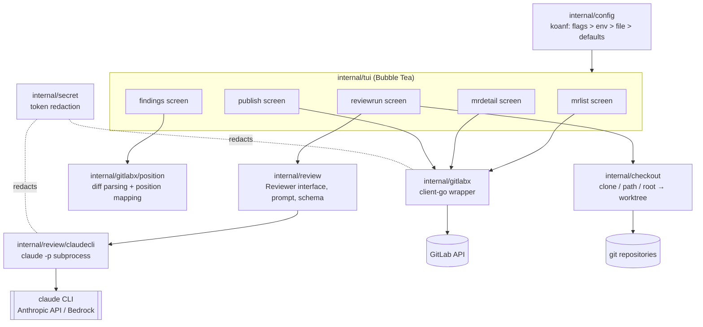
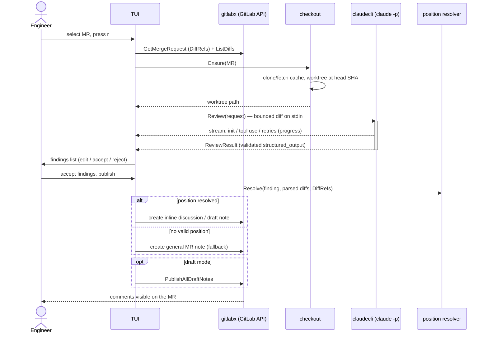

# Architecture

`gitlab-reviewer` is layered so that the TUI only sees small interfaces:
`gitlabx.Service` (GitLab API), `checkout.Manager` (repo on disk), and
`review.Reviewer` (AI backend). `internal/gitlabx` is the only package that
imports the GitLab client; `internal/review/claudecli` is the only package
that knows the `claude` binary exists.

## Component diagram

## Review flow

## Data flow summary

config → MR list → MR detail (diffs + existing discussions) → worktree at
head SHA → prompt (metadata + custom instructions + bounded diff) → `claude
-p` with read-only tools in the worktree (one pass per diff chunk for large
MRs, results merged) → schema-validated findings → user curation → position
mapping against parsed diff hunks → inline discussions or draft review
(with note fallback) on the MR.
